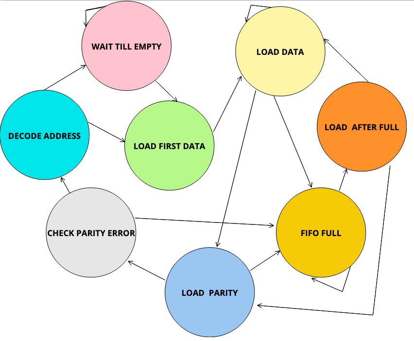
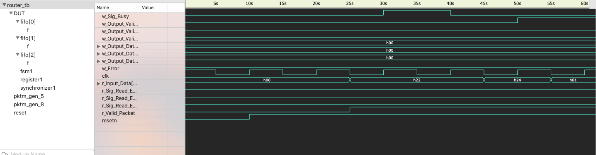

# Router 
Routing is the process of moving a packet of data from source to destination and enables messages
to pass from one computer to another and eventually reach the target machine. A router is a networking device
that forwards data packets between computer networks. It is connected to two or more data lines from different
networks.

## Implementation
In this project, the proposed design of the router includes components like FIFO, register,
synchronizer, FSM and input and output signals between them. The register implements 4 internal registers in order to hold a header byte, FIFO full state byte, internal parity and packet parity byte. The synchronizer provides synchronization between router FSM and router FIFO modules. It provides faithful
communication between the single input port and three output ports.

### States

This router has eight stages:

#### STATE_DECODE_ADDRESS 

   Next ==> STATE_LOAD_FIRST_DATA (Sig_Packet_Valid = 1, Sig_Fifo_Empty = 1)
   
   Next ==> STATE_WAIT_TILL_EMPTY (Sig_Packet_Valid = 1, Sig_Fifo_Empty = 0)
   
   

#### STATE_WAIT_TILL_EMPTY

   Next ==> STATE_WAIT_TILL_EMPTY (Sig_Fifo_Empty = 1)
   
   Next ==> STATE_LOAD_FIRST_DATA (Sig_Fifo_Empty = 0)
   

#### STATE_LOAD_FIRST_DATA 

   Next ==> STATE_LOAD_DATA
   

#### STATE_LOAD_DATA 

   Next ==> STATE_LOAD_PARITY (Sig_Packet_Valid = 0, Sig_Fifo_Full = 0)
   
   Next ==> STATE_FIFO_FULL (Sig_Fifo_Full = 1)
   
   Next ==> STATE_LOAD_DATA 
   

#### STATE_LOAD_PARITY 

   Next ==> STATE_FIFO_FULL (Sig_Fifo_Full = 1)
   
   Next ==> STATE_CHECK_PARITY_ERROR 
   

#### STATE_FIFO_FULL 

   Next ==> STATE_FIFO_FULL (Sig_Fifo_Full = 1)
   
   Next ==> STATE_LOAD_AFTER_FULL (Sig_Fifo_Full = 0)
   

#### STATE_LOAD_AFTER_FULL 

   Next ==> STATE_LOAD_DATA (Sig_Parity_Done = 0, Sig_Low_Packet_Valid = 0)
   
   Next ==> STATE_LOAD_PARITY (Sig_Parity_Done = 0, Sig_Low_Packet_Valid = 1)
   

#### STATE_CHECK_PARITY_ERROR 

   Next ==> STATE_FIFO_FULL (Sig_Fifo_Full = 1)
   
   Next ==> STATE_DECODE_ADDRESS (Sig_Fifo_Full = 0)
   

## Dependencies
### macOS
This project needs [Icarus-Verilog](http://iverilog.icarus.com) and a VCD viewer.

## Building on macOS
1. Icarus-Verilog can be installed via Homebrew :
   <code>$ brew install icarus-verilog</code>
2. Download [Scansion](http://www.logicpoet.com/scansion/) from here.  
3. Clone the repository.
4. <code>$ make simulate</code> will: 
* compile design+TB
* simulate the verilog design

5. <code>$ make display</code> will: 
*  display waveforms.
---

## References
1. [NoCRouter - RTL Router Design in SystemVerilog](https://github.com/agalimberti/NoCRouter)
2. [Router 1X3-RTL Design and Verification](https://www.researchgate.net/publication/329236255_Router_1X3-RTL_Design_and_Verification)
3. [DESIGN OF A 5 PORT ROUTER FOR NOC USING VERILOG](https://www.researchgate.net/publication/338296428_DESIGN_OF_A_5_PORT_ROUTER_FOR_NOC_USING_VERILOG)

#### TODO

 - ✅ Add specifications
 - ✅ Fifo: Fix output data 
 
